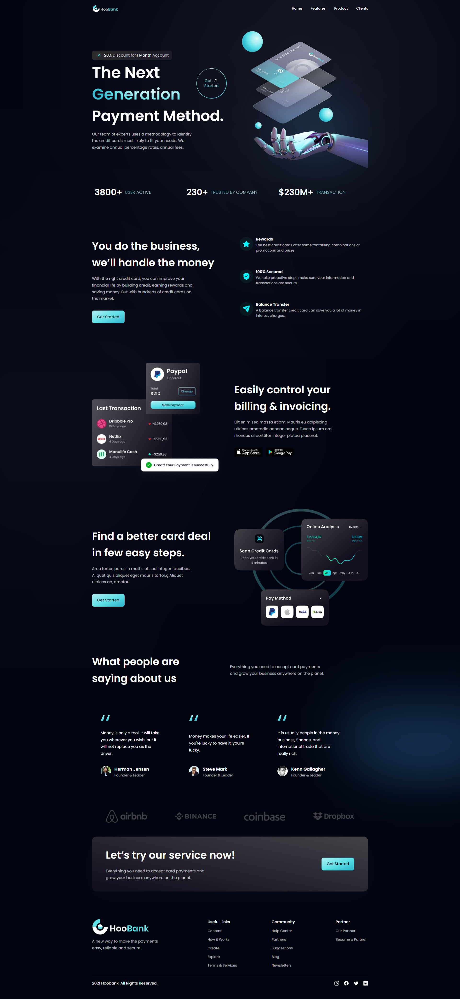

# Hoobank Modern Website
JavaScript Mastery Project

Este projeto foi desenvolvido durante o tutorial do canal [JavaScript Mastery](https://www.youtube.com/@javascriptmastery/videos), para estudar a criação e desenvolvimento de um website utilizanodo React. Foram utilizadas as seguintes ferramentas:

* [Visual Studio Code](https://code.visualstudio.com/)
* [Node / nvm](https://github.com/nvm-sh/nvm)
* [Vite](https://vitejs.dev/)
* [React + Javascript](https://pt-br.reactjs.org/)
* [Tailwind Css](https://tailwindcss.com/)

Durante o projeto foram abordados conceitos como:

* Criação do projeto utilizando Vite
* Instalação do framework Tailwind Css
* Criação de componentes
* Organização de pastas
* reaproveitamento de código
    * Foram criados arquivos específicos para organizar as listas de menus utilizando arrays, na pasta *constants*, e para organizar algumas edições utilizando classes do tailwind css, no arquivo *style.js*.

O resultado:

Abaixo deixo a referência do tutorial inicial, dando os créditos ao criador do canal:
<https://www.youtube.com/watch?v=_oO4Qi5aVZs>